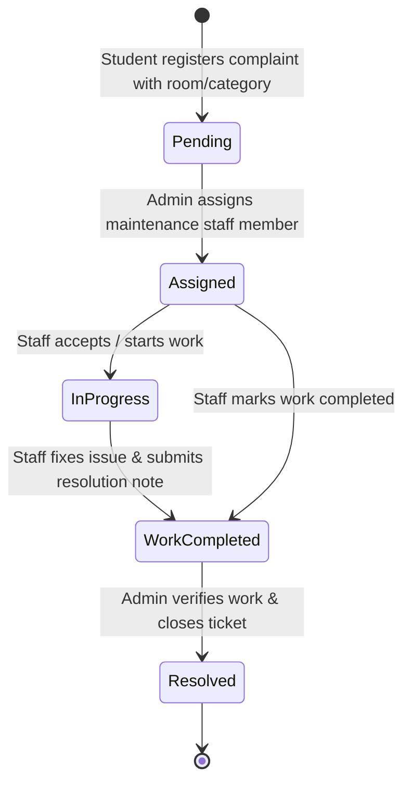

# 🏠 Smart Hostel Complaint Management System (SHCMS)

[-61DAFB?logo=react&logoColor=black)](https://reactjs.org/)
[](https://nodejs.org/)
[](https://expressjs.com/)
[](https://www.mongodb.com/)
[](https://opensource.org/licenses/MIT)

> **A Full-Stack Role-Based Hostel Grievance Redressal and Maintenance Tracking System** designed to streamline hostel complaint handling, assign tasks to maintenance personnel, track real-time resolution stages, and maintain transparency between students and administration.

---

## 📌 1. Project Abstract & Motivation

### The Problem
Traditional hostel complaint mechanisms rely heavily on manual paper registers, informal chat messages, or verbal communication with hostel wardens. This leads to:
* **Untracked Complaints**: Grievances get lost or forgotten in registers.
* **Lack of Accountability**: Unclear assignment of maintenance tasks to electricians, plumbers, or cleaners.
* **Zero Status Transparency**: Students have no visibility into whether their complaint is pending, assigned, or under repair.
* **Delayed Resolution & Administrative Overhead**: Wardens manually coordinate tasks without real-time tracking metrics or closure verification.

### The Solution
The **Smart Hostel Complaint Management System (SHCMS)** provides a modern, 3-tier digital platform featuring:
* Role-Based Access Control (**Student**, **Maintenance Staff**, and **Hostel Administrator**).
* Exact **Room No. / Location Tagging** for pinpoint maintenance dispatch.
* Dynamic **Workflow State Engine**: `Pending` &rarr; `Assigned` &rarr; `In Progress` &rarr; `Work Completed` &rarr; `Resolved`.
* Dedicated **Resolution Remarks** recorded by technicians upon job completion.
* Executive **Admin Dashboard** with real-time KPI metrics and staff personnel management.

---

## 🔄 2. System Architecture & Workflow

### 🏗️ 3-Tier Architecture
```
┌────────────────────────────────────────────────────────┐
│                   PRESENTATION TIER                    │
│      React 18 + Vite (SPA, Responsive CSS, Modals)      │
└───────────────────────────▲────────────────────────────┘
                            │ RESTful JSON over HTTP
┌───────────────────────────▼────────────────────────────┐
│                    APPLICATION TIER                    │
│      Node.js & Express API Server (CORS, Mongoose)     │
└───────────────────────────▲────────────────────────────┘
                            │ Mongoose ODM / Driver
┌───────────────────────────▼────────────────────────────┐
│                       DATA TIER                        │
│       MongoDB Atlas Cloud Database (Document Store)     │
└────────────────────────────────────────────────────────┘
```

### 🔁 Complaint Lifecycle State Machine



---

## 👥 3. Role-Based Modules & Key Features

### 👨‍🎓 1. Student Portal
* **Student Registration & Authentication**: Secure sign up and login with validation.
* **File Grievance**: Select issue category (*Electricity, Plumbing, Wifi, Cleanliness, Mess, Furniture, Other*), specify exact **Room No. / Place 📍** (e.g. `Room 204, Block B`), title, and detailed description.
* **Personal Complaint Tracker**: Real-time status cards showing assigned technician, timestamp, current status badge, and staff completion remarks.

### 🛠️ 2. Maintenance Staff Portal
* **Role-Based Task List**: View only grievances assigned to the logged-in staff member.
* **Location & Contact Intelligence**: Inspect student details, phone/email, and exact hostel room location.
* **Status Updates**: Transition tasks from `Assigned` &rarr; `In Progress`.
* **Completion Reporting**: Enter specific technical resolution notes (*e.g., "Replaced burned capacitor on ceiling fan"*) and mark **"✅ Mark Completed"** in one click.

### 👑 3. Hostel Administrator Dashboard
* **Real-time KPI Metric Counters**: Instant counts for *Total Complaints*, *Pending*, *Assigned*, *In Progress*, and *Resolved*.
* **Complaint Dispatcher**: Review all hostel issues and assign available personnel (*Ramesh Kumar, Suresh Singh, Anita Sharma, etc.*).
* **Final Verification & Closure**: Inspect staff resolution notes and click **"✅ Verify & Resolve"** to mark complaint officially closed.
* **Staff Team Management**: Add new maintenance personnel with login credentials or remove inactive staff directly from the portal.

---

## 🛠️ 4. Technology Stack

| Layer | Technologies Used |
|---|---|
| **Frontend** | React 18, Vite, React Router DOM v6, Modern CSS3 (Grid/Flexbox/CSS Variables) |
| **Backend** | Node.js (v18+), Express.js (ES Modules), CORS, Dotenv |
| **Database** | MongoDB Atlas (Cloud NoSQL), Mongoose ODM v9 |
| **API Architecture** | RESTful HTTP JSON Protocol |
| **Tooling & Build** | Vite Build, Git, npm, Postman |

---

## 🗄️ 5. Database Schema & Data Models

### 1. `User` Schema
```javascript
{
  name: { type: String, required: true },
  email: { type: String, required: true, unique: true },
  password: { type: String, required: true },
  role: { type: String, enum: ['student', 'staff', 'admin'], required: true }
}
```

### 2. `Complaint` Schema
```javascript
{
  id: { type: String, unique: true },          // e.g. "C1001"
  studentName: { type: String, required: true },
  studentEmail: { type: String, required: true },
  title: { type: String, required: true },
  category: { type: String, required: true },  // e.g. "Electricity", "Plumbing"
  roomNo: { type: String, required: true },    // e.g. "Room 204, Block B"
  description: { type: String, required: true },
  date: { type: String },                      // e.g. "2026-09-28"
  assignedStaff: { type: String, default: "" },// e.g. "Suresh Singh"
  status: { 
    type: String, 
    enum: ['Pending', 'Assigned', 'In Progress', 'Work Completed', 'Resolved'], 
    default: 'Pending' 
  },
  remark: { type: String, default: "" }        // Staff resolution note
}
```

### 3. `Staff` Schema
```javascript
{
  name: { type: String, required: true, unique: true }
}
```

### 4. `Category` Schema
```javascript
{
  name: { type: String, required: true, unique: true }
}
```

---

## 📡 6. RESTful API Endpoints

| HTTP Method | Route | Description | Access |
|---|---|---|---|
| `GET` | `/` | API Health Check and status | Public |
| `GET` | `/api/staff` | Fetch list of active maintenance technicians | Authenticated |
| `GET` | `/api/categories` | Retrieve complaint classification categories | Public |
| `GET` | `/api/complaints` | Retrieve all complaints (supports `?studentEmail=` & `?assignedStaff=`) | Role Filtered |
| `POST` | `/api/login` | Authenticate user credentials and return role | Public |
| `POST` | `/api/signup` | Student self-registration | Public |
| `POST` | `/api/submit-complaint` | File a new complaint with location details | Student |
| `POST` | `/api/update-complaint` | Update status, assign staff, or attach resolution remark | Staff / Admin |
| `POST` | `/api/add-staff` | Register new maintenance personnel | Admin Only |
| `POST` | `/api/remove-staff` | Revoke staff personnel and account access | Admin Only |

---

## 🔑 7. Verified Demo Accounts (Direct Login)

For evaluation and testing, the system comes preloaded with the following verified credentials:

| Role | Email / Staff ID | Password | Full Name | Primary Dashboard |
|---|---|---|---|---|
| **👨‍🎓 Student** | `demo@student.com` | `1234` | Demo Student | `/student` |
| **🛠️ Staff (Suresh)** | `suresh@staff.com` | `1234` | Suresh Singh | `/staff` |
| **🛠️ Staff (Ramesh)** | `ramesh@staff.com` | `1234` | Ramesh Kumar | `/staff` |
| **🛠️ Staff (Anita)** | `anita@staff.com` | `1234` | Anita Sharma | `/staff` |
| **🛠️ Staff (Vikas)** | `vikas@staff.com` | `1234` | Vikas Yadav | `/staff` |
| **👑 Admin** | `admin@hostel.com` | `1234` | Hostel Admin | `/admin` |

*(New students can also register anytime via `/signup`).*

---

## 🚀 8. Installation & Setup Guide

### Prerequisites
* **Node.js** (v18.0.0 or higher)
* **npm** (v9.0.0 or higher)
* **Git** installed on your system

---

### Step 1: Clone the Repository
```bash
git clone https://github.com/Bharat2306/complaint-system-5.git
cd complaint-system-5
```

### Step 2: Configure Environment Variables
Inside the `backend/` folder, create a `.env` file (or copy from `.env.example`):
```bash
# backend/.env
PORT=5000
MONGODB_URI=your_mongodb_atlas_connection_string
```
*(A cloud MongoDB connection fallback is preconfigured in `backend/server.js` for instant out-of-the-box evaluation).*

---

### Step 3: Run Backend Server
```bash
cd backend
npm install
npm start
```
> Server runs on: **http://localhost:5000**  
> Database seeding utility: `npm run seed`  
> Database cleaner utility: `npm run clean`

---

### Step 4: Run Frontend Application
Open a new terminal window:
```bash
cd frontend
npm install
npm run dev
```
> Frontend Client runs on: **http://localhost:5173**

---

### Root Convenience Commands
From the project root directory, you can also run:
```bash
npm run install:all     # Installs both backend & frontend dependencies
npm run start:backend   # Launches backend server
npm run start:frontend  # Launches frontend dev server
npm run seed            # Seeds default accounts & categories into MongoDB
npm run clean           # Cleans dummy complaints from the database
```

---

## 📂 9. Project Directory Structure

```plaintext
complaint-system-5/
├── backend/
│   ├── data/                 # Fallback offline JSON data store
│   │   ├── categories.json
│   │   ├── complaints.json   # Clean complaint store
│   │   ├── staff.json
│   │   └── users.json
│   ├── models/               # Mongoose Schema Definitions
│   │   ├── category.js
│   │   ├── complaints.js
│   │   ├── staff.js
│   │   └── user.js
│   ├── .env.example          # Sample environment variables
│   ├── cleanDb.js            # DB reset script
│   ├── seed.js               # DB seed script
│   ├── package.json          # Backend dependencies
│   └── server.js             # Express REST API Server
│
├── frontend/
│   ├── src/
│   │   ├── components/       # Reusable UI Components
│   │   │   ├── Navbar.jsx    # Role-aware Navigation Bar
│   │   │   └── StatusBadge.jsx # Color-coded Status Badges
│   │   ├── pages/            # Role-Based Views
│   │   │   ├── Admin.jsx     # Admin Dashboard & Staff Manager
│   │   │   ├── Login.jsx     # Multi-Role Portal Login
│   │   │   ├── Signup.jsx    # Student Self-Registration
│   │   │   ├── Staff.jsx     # Maintenance Technician Portal
│   │   │   └── Student.jsx   # Student Grievance Filing & Tracking
│   │   ├── utils/
│   │   │   ├── api.js        # Centralized HTTP Client
│   │   │   └── useRequireRole.js # Route Guard Hook
│   │   ├── App.jsx           # Client Route Configuration
│   │   ├── index.css         # Responsive Stylesheet
│   │   └── main.jsx          # React DOM Root
│   ├── index.html            # Vite HTML Template
│   ├── package.json          # Frontend dependencies
│   └── vite.config.js        # Vite Configuration
│
├── .gitignore                # Production ignore rules
├── package.json              # Root unified runner
└── README.md                 # Project Documentation
```

---

## 🔮 10. Future Scope & Enhancements

* **Photo / Video Attachment**: Allow students to capture and upload images of broken appliances using Multer & Cloudinary.
* **Automated SMS & WhatsApp Alerts**: Notify students via Twilio API when their issue status changes to `Work Completed` or `Resolved`.
* **AI-Powered Priority Queueing**: Integrate NLP model to analyze complaint description sentiment and automatically assign priority flags (`Urgent`, `High`, `Normal`).
* **Student Feedback & Rating**: Enable 1-5 star ratings for technicians upon issue resolution to maintain service quality metrics.

---

## 👨‍💻 11. Authors & Academic Credits

* **Bharat Rajput** ([@Bharat2306](https://github.com/Bharat2306))
* **Degree**: B.E. / B.Tech in Computer Science & Engineering (CSE)
* **Domain**: Full Stack Web Development & Database Engineering

---

## 📄 12. License

This project is licensed under the [MIT License](LICENSE) - open for educational and development purposes.
